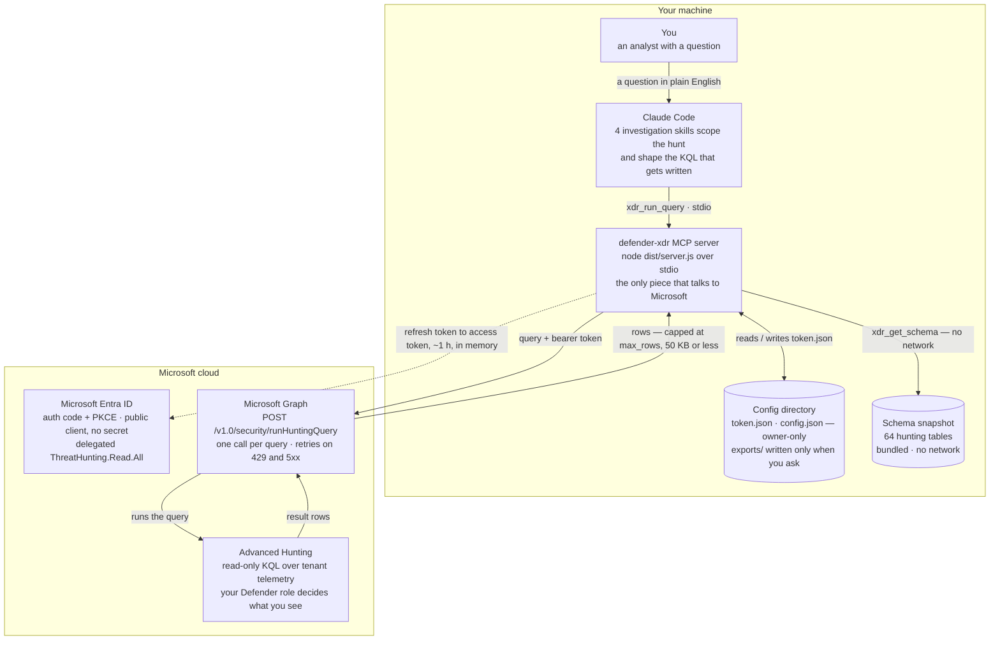
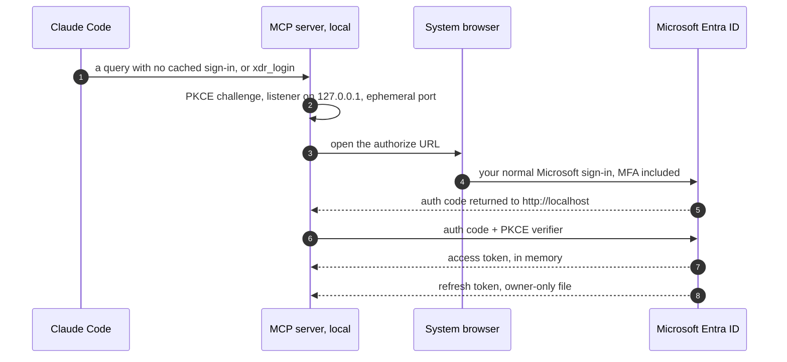

# Defender XDR Plugin Architecture

You ask a question in plain English. Claude writes the KQL, an MCP server on **your own
machine** runs it against Advanced Hunting through Microsoft Graph, and the rows come back for
Claude to explain. Two calls leave the machine — one to Entra for a token, one to Graph for the
query — and **every path is read-only**.

## The query path

One question, one round trip. Claude never touches Microsoft directly — it calls a tool on a
local MCP server over stdio, and that server holds the token, makes the single Graph call, and
trims what comes back before it reaches the model. **Nothing in this path can change tenant
state.**

## The four tools

| Tool | What it does |
| --- | --- |
| `xdr_run_query` | Runs one read-only KQL query and returns the rows. Takes a timespan and a row limit; the configured ceiling cannot be raised per call. |
| `xdr_get_schema` | Lists, searches, or describes hunting tables from a snapshot compiled into the server. No network, no sign-in required. |
| `xdr_login` | Opens your browser for the Microsoft sign-in, and saves the tenant and client IDs if they were missing. Normally needed once. |
| `xdr_logout` | Deletes the sign-in cached on this machine. The browser session with Microsoft is left untouched. |

## The skills layer

The tools are only half of it. The plugin also installs four investigation skills — a
cross-domain core plus endpoint, identity, and messaging branches. They are instructions, not
code: they load into Claude's context and govern *how* it hunts, not what the server will run.

- **Evidence funnel.** Frame the decision, measure cheaply, then retrieve only the smallest
  decisive records — instead of dumping raw events.
- **Cheapest table first,** then pivot on indicators — a hash, an IP, a sender — rather than
  widening the time window.
- **Read-only by contract.** The skills route every operational change into recommendations,
  because the plugin cannot make one.

## Signing in, once

An authorization-code flow with PKCE against a loopback listener on an ephemeral port. There is
no client secret and no device code — which is why sign-in can happen inside a tool call, with
no terminal. After this, queries refresh silently until Microsoft expires or revokes the grant.

## Guardrails

- **One permission.** Delegated `ThreatHunting.Read.All`. Advanced Hunting cannot modify the
  tenant, and your own Defender role still bounds what you can see.
- **A ceiling Claude cannot raise.** `max_rows` (1000 by default) is applied as a minimum
  against whatever the model asks for, and tool output is truncated at 50 KB with a visible
  notice.
- **Bounded requests.** Four-minute wall clock, three attempts with `Retry-After` honoured,
  25 MiB response cap.
- **Local secrets stay local.** The refresh token lives in a file only your account can read;
  bearer tokens are redacted out of error text before it ever reaches the model.
- **Full result sets are opt-in.** Complete rows are written to `exports/` only when you
  explicitly ask for them.

---

Drawn from the plugin source at v1.0.0 — `src/server.ts`, `src/auth.ts`, `src/graph.ts`, and
the bundled schema snapshot dated 13 April 2026 (64 tables: 42 active, 19 preview, 3 retired).
