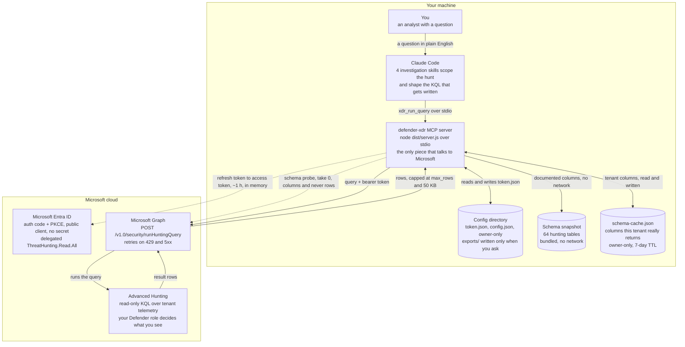
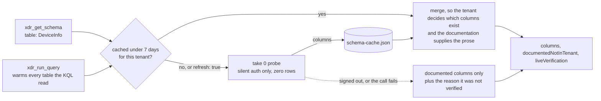
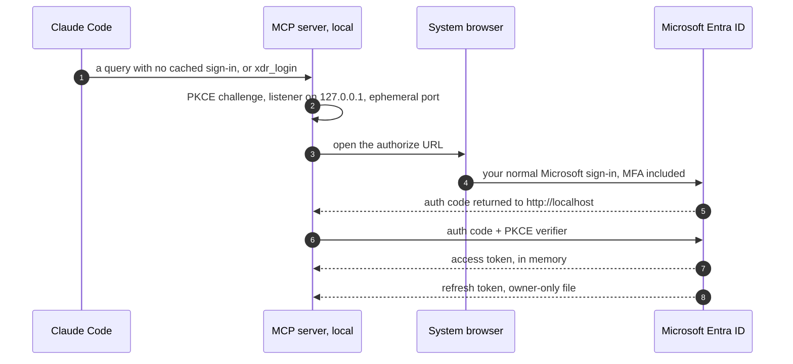

# Defender XDR plugin architecture

You ask a question in plain English. Claude writes the KQL, an MCP server on **your own machine**
runs it against Advanced Hunting through Microsoft Graph, and the rows come back for Claude to
explain. Two calls leave the machine, one to Entra for a token and one to Graph for the query.
**Every path is read-only.**

## The query path

Claude never touches Microsoft directly. It calls a tool on a local MCP server over stdio, and
that server holds the token, makes the Graph call, and trims what comes back before it reaches
the model. **Nothing in this path can change tenant state.**

## The four tools

| Tool | What it does |
| --- | --- |
| `xdr_run_query` | Runs one read-only KQL query and returns the rows. Takes a timespan and a row limit. The configured ceiling cannot be raised per call. |
| `xdr_get_schema` | Lists, searches, or describes hunting tables. Listing and searching read local files only. Describing an exact table also asks the tenant for its real columns and caches the answer. |
| `xdr_login` | Opens your browser for the Microsoft sign-in, and saves the tenant and client IDs if they were missing. Normally needed once. |
| `xdr_logout` | Deletes the sign-in cached on this machine, and the cached tenant schema with it. The browser session with Microsoft is left alone. |

## Two views of the schema

Every table lookup answers from two sources, and says which is which.

**The bundled snapshot** comes from Microsoft's published documentation, generated by
`scripts/update-schema-snapshot.mjs` and pinned to the docs commit it read. It carries 64 tables
with prose descriptions, retirement notices, and doc links. It needs no network and no sign-in,
and it is the only source that can explain what a column *means*. It is also a point in time,
and the product keeps moving.

**The tenant** gets asked with `TableName | take 0`, which returns the full column list and no
rows. That costs one Graph call and discloses no telemetry. Preview columns, licensing
differences, and custom tables exist only here.

The merge is lopsided on purpose. The tenant decides *which* columns exist, and the snapshot
supplies the descriptions, because each is the better authority on its own half. Documented
columns the tenant did not return get listed under `documentedNotInTenant` instead of dropped,
since their absence is itself an answer. They may be retired, unlicensed, or not yet rolled out
in your tenant.

Three things about the probe matter in practice.

It runs on **silent authentication only**, so a schema lookup can never pop open a browser
sign-in. A signed-out user gets the documented columns and a stated reason instead.

Every `xdr_run_query` call **warms the tables its KQL read**, because investigations open with a
question rather than a schema lookup. Waiting for someone to call `xdr_get_schema` first left the
cache empty at the exact moment it was needed. The warming probes are not awaited, so they never
slow a query down, and a table still inside its TTL costs nothing.

The cache is **keyed to the tenant**, so switching tenants discards it rather than serving one
tenant's columns for another.

## The skills layer

The tools are only half of it. The plugin also installs four investigation skills, a
cross-domain core plus endpoint, identity, and messaging branches. They are instructions rather
than code. They load into Claude's context and govern *how* it hunts, not what the server will
run.

- **Evidence funnel.** Frame the decision, measure cheaply, then retrieve only the smallest
  decisive records instead of dumping raw events.
- **Cheapest table first,** then pivot on an indicator such as a hash, an IP, or a sender,
  rather than widening the time window.
- **Read-only by contract.** The skills route every operational change into a recommendation,
  because the plugin cannot make one.

## Signing in, once

An authorization-code flow with PKCE against a loopback listener on an ephemeral port. There is
no client secret and no device code, which is why sign-in can happen inside a tool call with no
terminal. After this, queries refresh silently until Microsoft expires or revokes the grant.

## Guardrails

- **One permission.** Delegated `ThreatHunting.Read.All`. Advanced Hunting cannot modify the
  tenant, and your own Defender role still bounds what you can see.
- **A ceiling Claude cannot raise.** `max_rows`, 1000 by default, is applied as a minimum against
  whatever the model asks for, and tool output is truncated at 50 KB with a visible notice.
- **Bounded requests.** Four-minute wall clock, three attempts with `Retry-After` honoured,
  25 MiB response cap.
- **Local secrets stay local.** The refresh token lives in a file only your account can read, and
  bearer tokens are redacted out of error text before it reaches the model.
- **Full result sets are opt-in.** Complete rows go to `exports/` only when you ask for them.
- **No telemetry in the schema path.** The probe is `take 0`, and every table name is matched
  against a bare-identifier pattern before it reaches KQL, so nothing else can be smuggled into
  the query the plugin writes for itself.

---

Drawn from the plugin source at v1.2.1: `src/server.ts`, `src/auth.ts`, `src/graph.ts`,
`src/live-schema.ts`, and the bundled schema snapshot dated 13 April 2026, holding 64 tables of
which 42 are active, 19 preview, and 3 retired.
